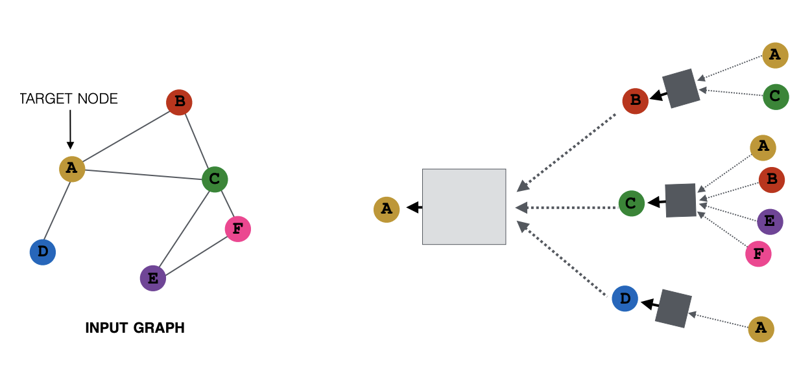

## Graph Neural Network
This project will focus on how to apply Graph Neural Networks (GNNs) to the task of node classification. Here, we are given the ground-truth labels of only a small subset of nodes, and want to infer the labels for all the remaining nodes (transductive learning).To demonstrate, we make use of the Cora dataset, which is a citation network where nodes represent documents. Each node is described by a 1433-dimensional bag-of-words feature vector. Two documents are connected if there exists a citation link between them. The task is to infer the category of each document (7 in total).
This dataset was first introduced by Yang et al. (2016) as one of the datasets of the Planetoid benchmark suite. We have used PyTorch Geometric for an easy access to this dataset
We have applied GNNs to real-world problems, and, in particular, how they can effectively be used for boosting a model's performance of a simple MLP.
We have used GNN Explainer on the network trained above by wrapping the model with the GNNExplainer wrapper class to explain the node classification.

   

   

## Approach

In theory, we should be able to infer the category of a document solely based on its content, i.e. its bag-of-words feature representation, without taking any relational information into account.
We verified that by constructing a simple MLP that solely operates on input node features (using shared weights across all nodes).Then we have comapared the accuracy of MLP with GNN.

## Input Data and its Visualization
Cora network holds 2,708 nodes and 10,556 edges, resulting in an average node degree of 3.9. For training this dataset, we are given the ground-truth categories of 140 nodes (20 for each class). 

## Output Node Classification

   

## Result

   

   

## GNN Expainer

GNN expaliner for NODE = 0

   

